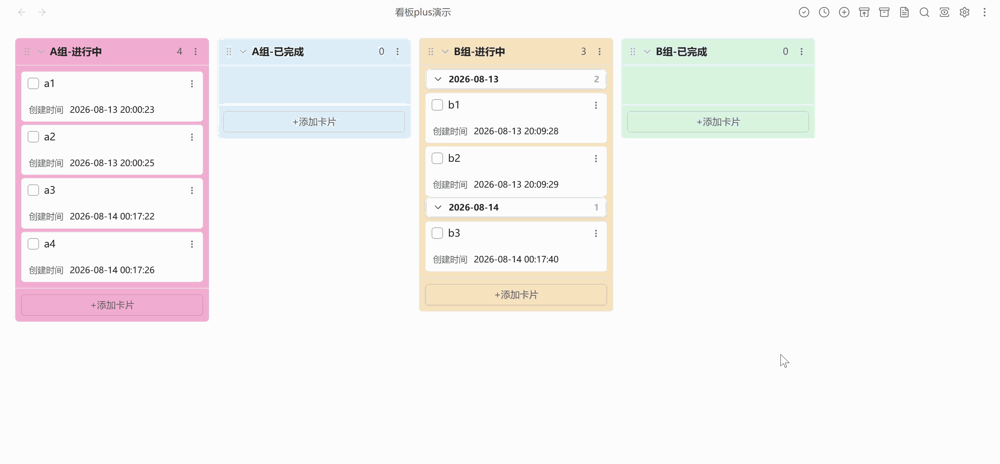

# Kanban Plus++

> 本项目基于 [community-archive/obsidian-kanban](https://github.com/community-archive/obsidian-kanban) 进行修改与扩展。
> 感谢原项目优秀的开源工作！
>
> This project is modified and extended from [community-archive/obsidian-kanban](https://github.com/community-archive/obsidian-kanban).
> Thanks to the original project for the excellent open-source work!

## 📖 项目简介 / Overview

Kanban Plus++ 是一个适用于 Obsidian 的 Markdown 看板插件。它以普通 Markdown 文件保存看板内容，支持看板、列表和表格视图，并在原有看板体验上扩展了完成列自动流转、来源追踪、取消归档、卡片时间记录、时间排序和列样式自定义等能力。

Kanban Plus++ is a Markdown-backed Kanban plugin for Obsidian. It stores boards as regular Markdown files, supports board, list, and table views, and extends the original Kanban workflow with automatic complete-list movement, source tracking, unarchive support, card time records, time-based sorting, and per-list styling.

## 👀 预览 / Preview

> 约 2 MB 文件大小的 GIF 动态预览图，请耐心等待加载。
>
> The preview is an approximately 2 MB GIF file. Please wait patiently while it loads.

## ✨ 新增功能 / New Features

| 功能                     | 描述                                                                                      | 默认值                                               |
| ------------------------ | ----------------------------------------------------------------------------------------- | ---------------------------------------------------- |
| 中英文界面               | 看板界面和设置页支持 English / 中文切换。                                                 | 自动 (跟随系统)；非中文环境使用 English             |
| 完成列自动流转           | 可将某个列标记为完成列，点击卡片复选框后自动移动到默认完成列。                            | 未设置默认完成列；若仅有一个完成列则自动使用该完成列 |
| 默认完成列按来源列设置   | 非完成列可以分别选择默认完成列，并可从列菜单中清除默认完成列；配置按稳定列 ID 保存。      | 未设置                                               |
| 取消完成返回来源列       | 完成任务时会记录来源列和原位置，取消完成后尽量返回来源列。                                | 始终启用                                             |
| 统一卡片持久化记录       | 卡片创建时间、完成时间、完成来源和归档来源统一保存到 `cards` 配置，替代旧的分散记录字段。 | 始终启用                                             |
| 归档卡片显隐按钮         | 看板顶部可显示/隐藏已归档卡片，便于在看板视图中查看归档内容。                             | 开启                                                 |
| 归档来源记录与取消归档   | 归档卡片会记录来源列、来源位置和归档时间，并可从归档区执行取消归档。                      | 始终启用                                             |
| 卡片创建时间             | 新卡片会记录创建时间，并可自定义创建时间显示格式。                                        | 格式 `YYYY-MM-DD HH:mm`；非完成列显示开启            |
| 卡片完成时间             | 卡片进入完成列时会记录完成时间，并可自定义完成时间显示格式。                              | 格式 `YYYY-MM-DD HH:mm`；完成列显示开启              |
| 时间显示快捷按钮         | 看板顶部可一键显示/隐藏所有列的创建时间或完成时间。                                       | 两个按钮均开启                                       |
| 完成列时间显示控制       | 可全局或按列控制完成列中创建时间、完成时间的显示。                                        | 创建时间关闭；完成时间开启                           |
| 列内排序规则             | 列菜单支持按卡片文本、日期、标签、创建时间、完成时间和内联元数据排序，并持久化排序规则。  | 非完成列手动排序；完成列默认按完成时间降序           |
| 手动排序完成列的入队位置 | 当完成列使用拖拽排序时，可设置通过复选框完成的卡片插入列头部或尾部。                      | 头部                                                 |
| 卡片时间分组与折叠       | 列菜单可按创建日期或完成日期对卡片分组，分组标题显示数量并支持折叠/展开。                 | 全局分组开关开启；每列默认不分组                     |
| 自定义列背景色           | 编辑列时可为单个列设置背景色，支持 `#RGB`、`#RRGGBB`、`rgb()` 和 `rgba()`。               | 未设置                                               |
| 列配置持久化             | 列折叠、默认完成列、背景色、分组方式、排序规则和时间显示配置统一保存到 `lanes` 配置。     | 始终启用                                             |

| Feature                                 | Description                                                                                                                      | Default                                                           |
| --------------------------------------- | -------------------------------------------------------------------------------------------------------------------------------- | ----------------------------------------------------------------- |
| Bilingual UI                            | Switch the board UI and settings page between English and Chinese.                                                               | Auto (follow system); English outside Chinese locales             |
| Automatic complete-list movement        | Mark a list as complete and move cards there automatically when their checkbox is checked.                                       | No default complete list; a single complete list is used directly |
| Source-specific default complete lists  | Incomplete lists can choose and clear their own default complete list from the list menu; settings are stored by stable list ID. | Not configured                                                    |
| Return to source on uncomplete          | Source list and original position are recorded when tasks are completed, so uncompleted cards can return to their source list.   | Always enabled                                                    |
| Unified card persistence                | Card created time, completed time, completion source, and archive source are stored in `cards`, replacing older split fields.    | Always enabled                                                    |
| Archive visibility button               | Toggle archived cards from the board header to inspect archived content in the board view.                                       | On                                                                |
| Archive source tracking and unarchive   | Archived cards remember their source list, source position, and archived time, and can be unarchived from the archive area.      | Always enabled                                                    |
| Card created time                       | New cards record their created time, with a configurable display format.                                                         | `YYYY-MM-DD HH:mm`; shown in incomplete lists                     |
| Card completed time                     | Cards record their completed time when moved into a complete list, with a configurable display format.                           | `YYYY-MM-DD HH:mm`; shown in complete lists                       |
| Time display header buttons             | Board header buttons can show or hide created times and completed times across all lists.                                        | Both buttons on                                                   |
| Complete-list time display controls     | Control created-time and completed-time visibility globally or per list for complete lists.                                      | Created time off; completed time on                               |
| Per-list sort rules                     | List menus can sort by card text, date, tags, created time, completed time, and inline metadata, with persisted sort rules.      | Incomplete lists manual; complete lists completed-time descending |
| Manual complete-list insertion position | When a complete list uses manual order, cards completed by checkbox can be inserted at the beginning or end.                     | Prepend                                                           |
| Card time grouping and folding          | List menus can group cards by created date or completed date, with count headers that can be collapsed or expanded.              | Global grouping toggles on; no per-list grouping by default       |
| Custom list background color            | Set a background color for each list while editing it; supports `#RGB`, `#RRGGBB`, `rgb()`, and `rgba()`.                        | Not configured                                                    |
| Persisted list settings                 | List collapse, default complete list, background color, grouping, sorting, and time display preferences are stored in `lanes`.   | Always enabled                                                    |

## 📦 安装 / Installation

### 从 Obsidian 社区插件安装 / From Obsidian Community Plugins

1. 打开 Obsidian -> **设置 -> 第三方插件**。
2. 点击 **浏览**，搜索 **Kanban Plus++**。
3. 点击 **安装**，然后 **启用**。

---

1. Open Obsidian -> **Settings -> Community plugins**.
2. Click **Browse** and search for **Kanban Plus++**.
3. Click **Install**, then **Enable**.

### 从 GitHub Releases 安装 / From GitHub Releases

1. 从最新 [release](../../releases) 下载 `main.js`、`styles.css` 和 `manifest.json`。
2. 放入 `<vault>/.obsidian/plugins/kanban-plus-xzhi`。
3. 重启 Obsidian，在 **设置 -> 第三方插件** 中启用 **Kanban Plus++**。

---

1. Download `main.js`, `styles.css`, and `manifest.json` from the latest [release](../../releases).
2. Place them in `<vault>/.obsidian/plugins/kanban-plus-xzhi`.
3. Restart Obsidian, then enable **Kanban Plus++** from **Settings -> Community plugins**.

## 🚀 使用 / Usage

1. 启用插件后，创建新的 Kanban 看板，或将空白笔记转换为看板。
2. 在看板中添加列和卡片；需要自动完成流转时，将目标列设置为完成列，并在来源列菜单中选择默认完成列。
3. 点击卡片复选框可将卡片移动到默认完成列；取消完成时，卡片会尽量返回记录的来源列。
4. 使用看板顶部按钮切换归档卡片显示，并在归档区对卡片执行取消归档。
5. 在插件设置中调整语言、完成卡片放置方式、日期/时间格式、创建时间显示、完成列创建时间显示、列宽、看板头部按钮和其他显示选项。
6. 双击列标题进入列编辑区域，可为单个列设置背景色，或将该列标记为完成列。

---

1. Enable the plugin, then create a new Kanban board or convert an empty note into a board.
2. Add lists and cards. For automatic completion workflows, mark a target list as complete and choose the default complete list from the source list menu.
3. Check a card checkbox to move it to the default complete list; unchecking it will try to restore the card to its recorded source list.
4. Use the board header button to show or hide archived cards, and unarchive cards from the archive area when needed.
5. Open the plugin settings to adjust language, completed-card placement, date/time formats, created-time display, created-time display in complete lists, list width, board header buttons, and other display options.
6. Double-click a list title to open list editing controls, where you can set a per-list background color or mark the list as complete.
