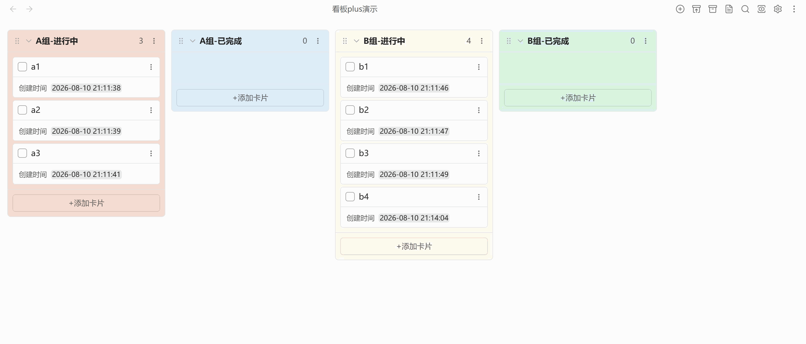

# Kanban Plus

> 本项目基于 [community-archive/obsidian-kanban](https://github.com/community-archive/obsidian-kanban) 进行修改与扩展。
> 感谢原项目优秀的开源工作！
>
> This project is modified and extended from [community-archive/obsidian-kanban](https://github.com/community-archive/obsidian-kanban).
> Thanks to the original project for the excellent open-source work!

## 📖 项目简介 / Overview

Kanban Plus 是一个适用于 Obsidian 的 Markdown 看板插件。它以普通 Markdown 文件保存看板内容，支持看板、列表和表格视图，并在原有看板体验上扩展了完成列自动流转、来源追踪、取消归档、卡片时间记录、时间排序和列样式自定义等能力。

Kanban Plus is a Markdown-backed Kanban plugin for Obsidian. It stores boards as regular Markdown files, supports board, list, and table views, and extends the original Kanban workflow with automatic complete-list movement, source tracking, unarchive support, card time records, time-based sorting, and per-list styling.

## 👀 预览 / Preview

## ✨ 新增功能 / New Features

| 功能                   | 描述                                                                        | 默认值                               |
| ---------------------- | --------------------------------------------------------------------------- | ------------------------------------ |
| 中英文界面             | 看板界面和设置页支持 English / 中文切换。                                   | English                              |
| 完成列自动流转         | 可将某个列标记为完成列，点击卡片复选框后自动移动到默认完成列。              | 未设置默认完成列；完成卡片插入列头部 |
| 默认完成列按来源设置   | 非完成列可以为不同来源列分别选择默认完成列，菜单使用二级菜单和单选框呈现。  | 未设置                               |
| 取消完成返回来源列     | 完成任务时会持久化来源记录，取消完成后可按原来源列返回。                    | 始终启用                             |
| 稳定来源追踪           | 为列表添加稳定 ID，用于更可靠地追踪卡片完成、归档和恢复时的来源。           | 始终启用                             |
| 归档卡片显隐按钮       | 看板顶部可显示/隐藏已归档卡片，便于在看板视图中查看归档内容。               | 开启                                 |
| 归档来源记录与取消归档 | 归档卡片会记录来源列和位置，并可从归档区执行取消归档。                      | 始终启用                             |
| 卡片创建时间           | 新卡片会记录创建时间，并可自定义创建时间显示格式。                          | 格式 `YYYY-MM-DD HH:mm`；显示开启    |
| 卡片完成时间           | 卡片进入完成列时会记录完成时间，并可自定义完成时间显示格式。                | 格式 `YYYY-MM-DD HH:mm`              |
| 完成列创建时间显示控制 | 可单独控制完成列中的卡片是否继续显示创建时间。                              | 关闭                                 |
| 时间排序               | 表格视图支持按创建时间、完成时间等时间字段排序。                            | 可用                                 |
| 自定义列背景色         | 编辑列时可为单个列设置背景色，支持 `#RGB`、`#RRGGBB`、`rgb()` 和 `rgba()`。 | 未设置                               |

| Feature                                | Description                                                                                                                   | Default                                                 |
| -------------------------------------- | ----------------------------------------------------------------------------------------------------------------------------- | ------------------------------------------------------- |
| Bilingual UI                           | Switch the board UI and settings page between English and Chinese.                                                            | English                                                 |
| Automatic complete-list movement       | Mark a list as complete and move cards there automatically when their checkbox is checked.                                    | No default complete list; completed cards are prepended |
| Source-specific default complete lists | Incomplete lists can choose different default complete lists per source list, shown with a submenu and radio-style selection. | Not configured                                          |
| Return to source on uncomplete         | Source records are persisted when tasks are completed, so uncompleted cards can return to their original list.                | Always enabled                                          |
| Stable source tracking                 | Stable list IDs make card source tracking more reliable across completion, archive, and restore workflows.                    | Always enabled                                          |
| Archive visibility button              | Toggle archived cards from the board header to inspect archived content in the board view.                                    | On                                                      |
| Archive source tracking and unarchive  | Archived cards remember their source list and position, and can be unarchived from the archive area.                          | Always enabled                                          |
| Card created time                      | New cards record their created time, with a configurable display format.                                                      | `YYYY-MM-DD HH:mm`; display on                          |
| Card completed time                    | Cards record their completed time when moved into a complete list, with a configurable display format.                        | `YYYY-MM-DD HH:mm`                                      |
| Created-time display in complete lists | Control whether cards in complete lists still show their created time.                                                        | Off                                                     |
| Time-based sorting                     | Table view can sort by created time, completed time, and other time fields.                                                   | Available                                               |
| Custom list background color           | Set a background color for each list while editing it; supports `#RGB`, `#RRGGBB`, `rgb()`, and `rgba()`.                     | Not configured                                          |

## 📦 安装 / Installation

### 从 Obsidian 社区插件安装 / From Obsidian Community Plugins

1. 打开 Obsidian -> **设置 -> 第三方插件**。
2. 点击 **浏览**，搜索 **Kanban Plus**。
3. 点击 **安装**，然后 **启用**。

---

1. Open Obsidian -> **Settings -> Community plugins**.
2. Click **Browse** and search for **Kanban Plus**.
3. Click **Install**, then **Enable**.

### 从 GitHub Releases 安装 / From GitHub Releases

1. 从最新 [release](../../releases) 下载 `main.js`、`styles.css` 和 `manifest.json`。
2. 放入 `<vault>/.obsidian/plugins/kanban-plus`。
3. 重启 Obsidian，在 **设置 -> 第三方插件** 中启用 **Kanban Plus**。

---

1. Download `main.js`, `styles.css`, and `manifest.json` from the latest [release](../../releases).
2. Place them in `<vault>/.obsidian/plugins/kanban-plus`.
3. Restart Obsidian, then enable **Kanban Plus** from **Settings -> Community plugins**.

## 🚀 使用 / Usage

1. 启用插件后，创建新的 Kanban 看板，或将空白笔记转换为看板。
2. 在看板中添加列和卡片；需要自动完成流转时，将目标列设置为完成列，并在来源列菜单中选择默认完成列。
3. 点击卡片复选框可将卡片移动到默认完成列；取消完成时，卡片会尽量返回记录的来源列。
4. 使用看板顶部按钮切换归档卡片显示，并在归档区对卡片执行取消归档。
5. 在插件设置中调整语言、完成卡片放置方式、日期/时间格式、创建时间显示、完成列创建时间显示、列宽、看板头部按钮和其他显示选项。
6. 双击列标题进入列编辑区域，可为单个列设置背景色，或将该列标记为完成列。

---

1. Enable the plugin, then create a new Kanban board or convert an empty note into a board.
2. Add lists and cards. For automatic completion workflows, mark a target list as complete and choose the default complete list from the source list menu.
3. Check a card checkbox to move it to the default complete list; unchecking it will try to restore the card to its recorded source list.
4. Use the board header button to show or hide archived cards, and unarchive cards from the archive area when needed.
5. Open the plugin settings to adjust language, completed-card placement, date/time formats, created-time display, created-time display in complete lists, list width, board header buttons, and other display options.
6. Double-click a list title to open list editing controls, where you can set a per-list background color or mark the list as complete.
